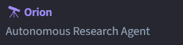
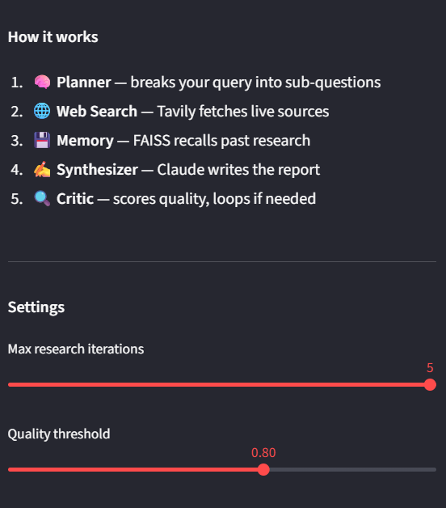
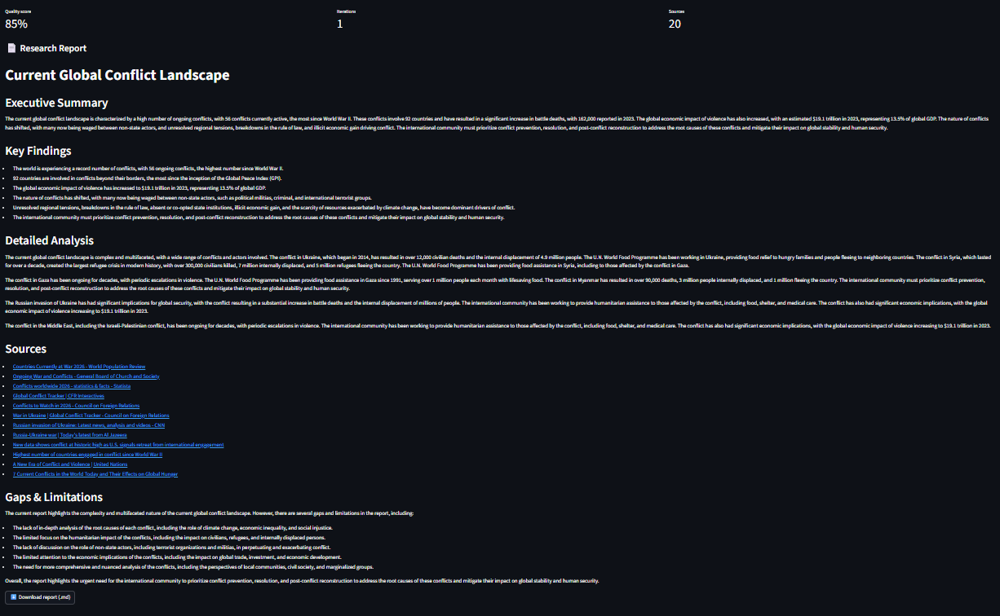

<div align="center">

# 🔭 Orion — Autonomous Research Agent

**Drop a question. Get a cited, structured research report in minutes.**

[](https://python.org)
[](https://github.com/langchain-ai/langgraph)
[](https://groq.com)
[](https://tavily.com)
[](https://github.com/facebookresearch/faiss)
[](https://streamlit.io)


</div>

---
---

## 🌐 Live Demo

**[🚀 Try Orion Live](https://pzsqjbkzxiofgbepglbaa2.streamlit.app/)** - No installation required!

---

## 📸 Screenshots

### Title & Branding


### Dashboard


### Search & Query


### Research Output


---

## 🧠 How It Works

Orion is a multi-agent research pipeline. You ask a question — it autonomously plans, searches, remembers, synthesizes, and critiques until the report meets quality standards.

```
Your Query
    │
    ▼
🧠 Planner (Llama 3.3 70B)     → breaks into targeted sub-questions
    │               │
    ▼               ▼
🌐 Tavily Search   💾 FAISS Recall    ← run in parallel
    │                   │
    ▼                   │
💾 FAISS Store ◄────────┘            ← persist new findings
    │
    ▼
✍️  Synthesizer (Llama 3.3 70B)      ← writes structured report
    │
    ▼
🔍 Critic (Llama 3.3 70B)           ← scores quality 0.0 → 1.0
    │               │
    ▼               ▼
  DONE ✅      loop back 🔁          ← iterate if score < 0.8
```

### Agent nodes

| Node | Role | Tool |
|---|---|---|
| `planner` | Decomposes query into sub-questions | Llama 3.3 70B (Groq) |
| `searcher` | Fetches live web evidence | Tavily |
| `memory_retrieve` | Recalls relevant past research | FAISS |
| `memory_store` | Embeds & persists new findings | FAISS |
| `synthesizer` | Compiles everything into a report | Llama 3.3 70B (Groq) |
| `critic` | Scores quality, loops or finishes | Llama 3.3 70B (Groq) |

---

## 🚀 Quick Start

### 1. Clone & install

```bash
git clone https://github.com/YOUR_USERNAME/orion-research-agent
cd orion-research-agent
python -m venv .venv
.venv\Scripts\activate        # Windows
pip install -r requirements.txt
```

### 2. Get free API keys

| Key | Where to get |
|---|---|
| `GROQ_API_KEY` | [console.groq.com](https://console.groq.com) — free, no credit card |
| `TAVILY_API_KEY` | [app.tavily.com](https://app.tavily.com) — free tier: 1000 searches/month |

### 3. Configure

```bash
copy .env.example .env    # Windows
```

Edit `.env`:
```
GROQ_API_KEY=gsk_xxxxxxxxxxxxxxxxxxxxxxxx
TAVILY_API_KEY=tvly-xxxxxxxxxxxxxxxx
```

### 4. Run

```bash
streamlit run app.py
```

Open [http://localhost:8501](http://localhost:8501) and start researching. 🔭

---

## ⚙️ Configuration

All parameters are in `config.py`:

| Setting | Default | Description |
|---|---|---|
| `GROQ_MODEL` | `llama-3.3-70b-versatile` | LLM for all reasoning nodes |
| `MAX_SUB_QUESTIONS` | `5` | Sub-questions the planner generates |
| `SEARCH_RESULTS_PER_QUERY` | `5` | Tavily results per sub-question |
| `MEMORY_TOP_K` | `5` | FAISS chunks recalled per run |
| `MAX_ITERATIONS` | `3` | Research loop safety cap |
| `QUALITY_THRESHOLD` | `0.8` | Critic score (0–1) to accept report |
| `EMBEDDING_MODEL` | `all-MiniLM-L6-v2` | SentenceTransformer for FAISS |

---

## 📁 Project Structure

```
Orion/
├── app.py                  ← Streamlit web UI
├── graph.py                ← LangGraph pipeline definition
├── state.py                ← AgentState TypedDict
├── config.py               ← All configuration & API keys
├── main.py                 ← CLI entry point
├── agent_nodes/
│   ├── __init__.py
│   ├── planner.py          ← Sub-question generation (Groq)
│   ├── searcher.py         ← Web search (Tavily)
│   ├── memory.py           ← FAISS store + retrieve
│   ├── synthesizer.py      ← Report writing (Groq)
│   └── critic.py           ← Quality evaluation (Groq)
├── screenshot/             ← UI screenshots
├── faiss_store/            ← Persistent vector index (auto-created)
├── reports/                ← Saved research reports (auto-created)
├── requirements.txt
└── .env.example
```


---

## 🔧 Extending Orion

**Add a new node** (e.g. PDF reader):
1. Create `agent_nodes/pdf_reader.py` with `pdf_reader_node(state) -> dict`
2. Register in `graph.py`: `graph.add_node("pdf_reader", pdf_reader_node)`
3. Wire it: `graph.add_edge("searcher", "pdf_reader")`

**Swap the LLM** — change `GROQ_MODEL` in `config.py` to any model on Groq's free tier.

**Async search** — replace sequential Tavily calls in `searcher.py` with `asyncio.gather` for faster parallel fetching.

---
## 👤 Author

**Sumit Mishra**

- GitHub: [@sumittt2004](https://github.com/sumittt2004)
- LinkedIn: [Sumit Mishra](https://www.linkedin.com/in/mishra-sumit-/)


---

<div align="center">
Built with LangGraph · Groq · Tavily · FAISS · Streamlit
</div>
